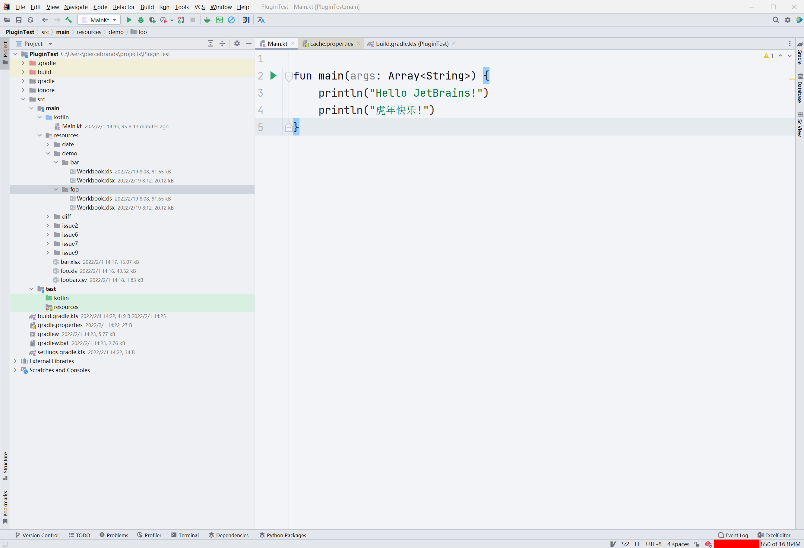

# ExcelEditor

<!-- Plugin description -->
This plugin is an Enhanced Edition of [**ExcelReader**](https://plugins.jetbrains.com/plugin/14722-excelreader).
Has all the features of ExcelReader. And additionally provides:

+ Open multiple files (supports Excel files with the same name)
+ Data modification
+ File comparison
+ Excel Merge Function

For more details, please see the [document](https://obiscr.github.io/docs/ExcelEditor)

**Note** : For particularly important data, it is recommended to use
professional Excel tools to modify and merge. If you want to use this tool
to modify or merge important data, be sure to back up your data before doing so.
<!-- Plugin description end -->

# Installation

- Using IDE built-in plugin system:

  <kbd>Settings/Preferences</kbd> > <kbd>Plugins</kbd> > <kbd>Marketplace</kbd> > <kbd>Search for "ExcelEditor"</kbd> >
  <kbd>Install Plugin</kbd>

# Notice

If you have installed the [ExcelReader](https://plugins.jetbrains.com/plugin/14722-excelreader) 
plugin before, ExcelReader can be uninstalled or disabled 
when you purchase ExcelEditor. Both of them cannot be enabled 
at the same time.

Maybe you will get a prompt like the following when you start the IDE:

At this point, choose to **Use ExcelEditor by obiscr**.